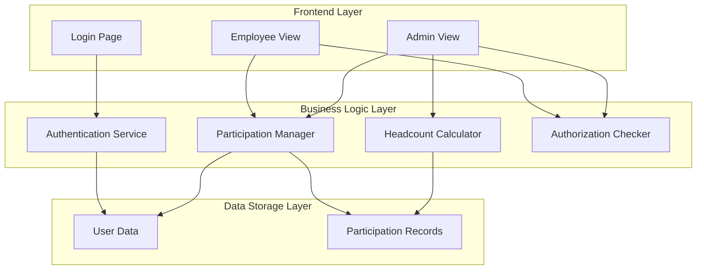
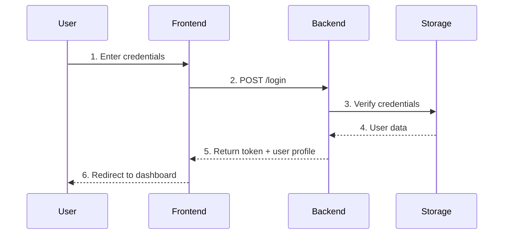
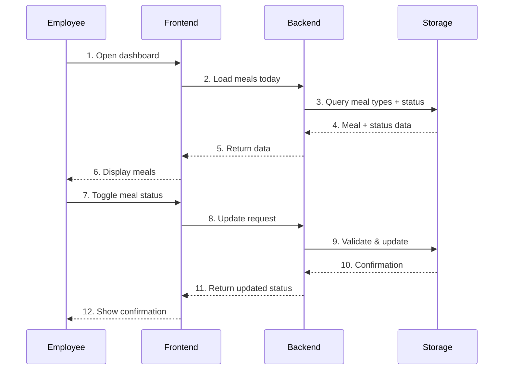
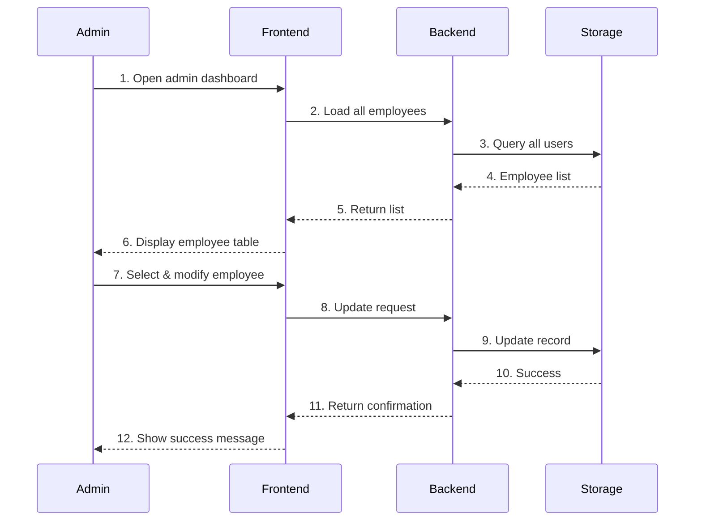
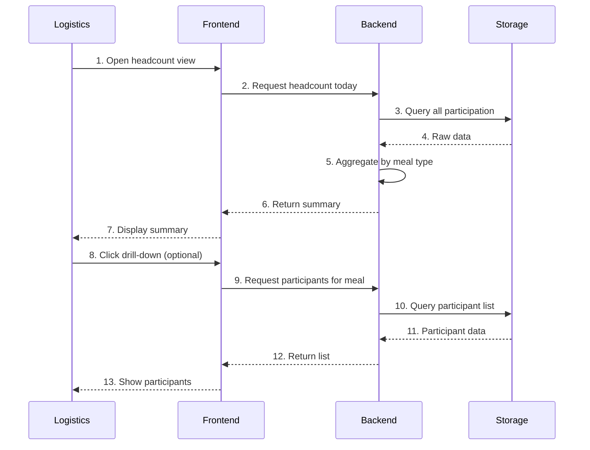
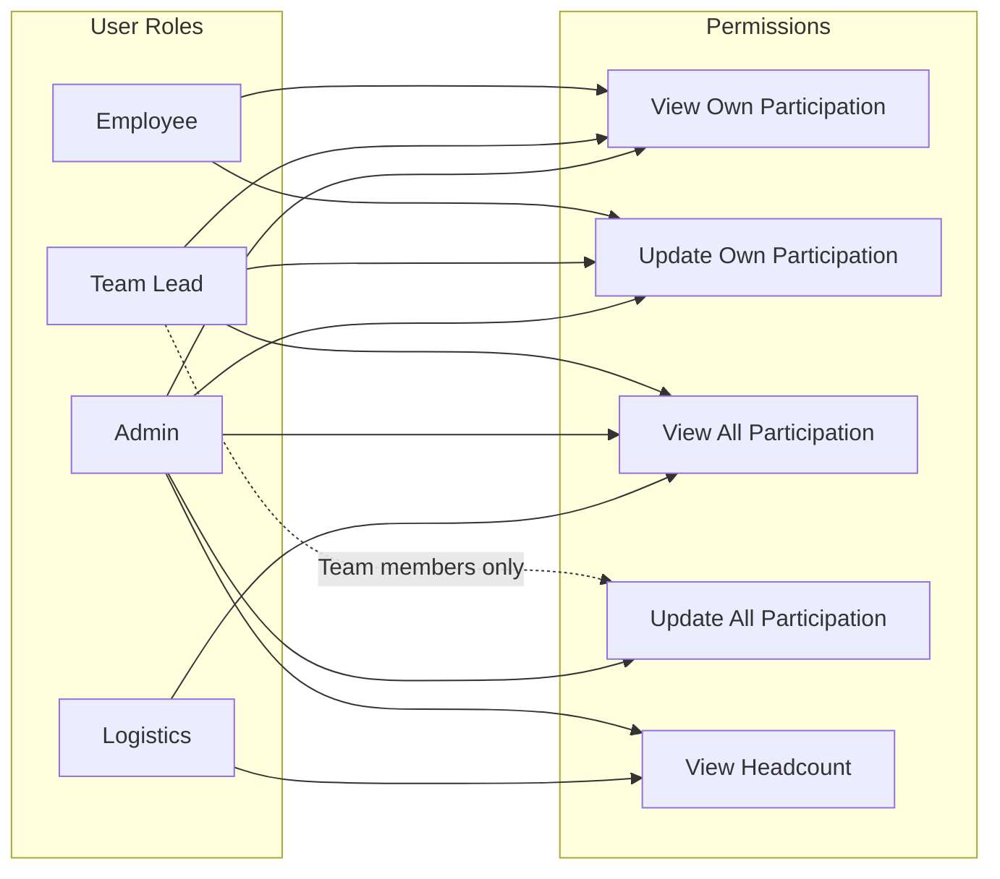

# Technical Specification: Meal Headcount Planner (MHP)
## Iteration 1 — Daily Meal Opt-In/Out + Basic Visibility

**Document Version:** 1.0  
**Project Phase:** Iteration 1  
**Date:** February 9, 2026   
**Status:** Draft

---

## Table of Contents

1. [Scope](#scope)
2. [Key Flows](#key-flows)
3. [Assumptions](#assumptions)
4. [Verification Approach](#verification-approach)

---

## 1. Scope

### 1.1 In-Scope Features (Iteration 1)

#### Authentication & User Access
| Feature | Description | Priority |
|---------|-------------|----------|
| User Login | Users can log in with basic credentials | P0 |
| Role-Based Access | Support for 4 roles: Employee, Team Lead, Admin, Logistics | P0 |

**Details:**
- Simple username/password authentication
- Session management with timeout
- Role assignment managed by Admin/Logistics

#### Employee Meal Participation
| Feature | Description | Priority |
|---------|-------------|----------|
| View Today's Meals | Employees can view available meals for today | P0 |
| View Status | See current participation status for each meal | P0 |
| Opt Out | Employees can opt out of specific meals | P0 |
| Opt Back In | Employees can opt back into meals | P0 |
| Default Opt-In | Default behavior: all meals opted in | P0 |

**Details:**
- Default assumption: everyone is coming for applicable meals unless they explicitly opt out
- Employees can update their choice within a defined cutoff window (cutoff rule to be provided later)
- Visual indication of current status (participating / opted out)

#### Meal Types
The system supports the following meal categories:
- Lunch
- Snacks
- Iftar
- Event Dinner
- Optional Dinner

**Details:**
- Meal types are pre-configured in the system
- For Iteration 1, assume all meal types are available every day
- Special day contexts (office closed, govt holiday, celebrations) will be handled in later iterations

#### Admin / Team Lead Support
| Feature | Description | Priority |
|---------|-------------|----------|
| View All Employees | Team Leads / Admin can view all employee participation | P0 |
| Mark Participation | Admin can mark participation on behalf of employee | P1 |
| Correct Entries | Admin can correct missing entries when needed | P1 |

**Details:**
- Team Leads and Admins have view access to all employees
- Logistics/Admins can modify participation status for any employee
- No approval workflow for overrides in Iteration 1

#### Headcount View
| Feature | Description | Priority |
|---------|-------------|----------|
| View Totals | Logistics/Admin can see headcount totals per meal type | P0 |
| Filter by Today | Default view shows "today's" headcount | P0 |
| View Participants | See list of who opted in (optional) | P1 |

**Details:**
- Logistics and Admin roles can see aggregated totals
- Breakdown by meal type shows: total employees, participating count, opted-out count
- Real-time updates as employees change their status

### 1.2 Out-of-Scope (Iteration 1)

The following features are **NOT** included in Iteration 1:

- Password reset functionality
- Email notifications/confirmations
- Cutoff window enforcement and notifications
- Historical data viewing (beyond "today")
- Multi-day planning (only current day supported)
- Special day configuration (holidays, office closure, celebrations)
- Reporting or export functionality
- Guest/visitor meal management
- Dietary preference tracking
- Bulk operations (mass opt-in/opt-out)
- Mobile application (responsive web only)
- Integration with HR systems or external data sources
- SSO integration (Active Directory, LDAP, etc.)

---

## 2. Key Flows

### 2.1 System Overview

---

### 2.2 User Authentication Flow

**Flow Steps:**

1. **User enters credentials** on login page (username + password)
2. **Frontend sends login request** to backend
3. **Backend verifies credentials** against stored user data
4. **Backend returns authentication token** + user profile with role
5. **Frontend redirects user** to appropriate dashboard based on role

**Error Handling:**
- Invalid credentials → Error message
- Account locked → Error message
- Server error → Generic error message

---

### 2.3 Employee Meal Participation Flow

**Flow Steps:**

1. **Employee opens dashboard** to view today's meals
2. **Frontend loads today's meals** from backend
3. **Backend queries** available meal types and employee's current status
4. **Backend returns** meal list with participation status
5. **Frontend displays** all meal types with current status
6. **Employee toggles** one or more meals (opt in/opt out)
7. **Frontend sends update request** to backend
8. **Backend validates** and updates participation record
9. **Backend returns** updated status
10. **Frontend shows confirmation** and refreshes display

**Business Rules:**
- Default state: All meals opted in (participating)
- Changes apply immediately (no confirmation required)
- No restrictions on number of changes per session
- Changes visible in real-time to Admin/Logistics

---

### 2.4 Admin / Team Lead Override Flow

**Flow Steps:**

1. **Admin/Team Lead opens dashboard** with elevated privileges
2. **Frontend loads all employees** with participation status
3. **Backend queries** all employees and their participation
4. **Backend returns** list of employees with current status
5. **Frontend displays** employee table with search/filter options
6. **Admin selects employee** and modifies meal checkboxes
7. **Frontend sends update** to backend
8. **Backend updates** employee participation
9. **Backend returns** success confirmation
10. **Frontend shows success message** and refreshes display

**Business Rules:**
- **Team Leads:** Can view all employees, modify team members' participation
- **Admin/Logistics:** Can view and modify all employees' participation
- No approval workflow in Iteration 1

---

### 2.5 Headcount View Flow

**Flow Steps:**

1. **Logistics/Admin opens headcount dashboard**
2. **Frontend requests** headcount summary for today
3. **Backend queries** all participation data for the date
4. **Backend aggregates** totals by meal type
5. **Frontend displays** summary table with totals
6. **[Optional]** Admin clicks to drill down into a meal type
7. **Frontend requests** participant list for specific meal
8. **Backend queries** and returns participant list
9. **Frontend shows** detailed participant list
10. **Data refreshes** automatically or on manual refresh

**Sample Data Display:**

| Meal Type      | Total Employees | Participating | Opted Out |
|----------------|-----------------|----------------|-----------|
| Lunch          | 120             | 115            | 5         |
| Snacks         | 120             | 100            | 20        |
| Iftar          | 120             | 45             | 75        |
| Event Dinner   | 120             | 80             | 40        |
| Optional Dinner| 120             | 30             | 90        |

---

### 2.6 Role-Based Access Control

**Legend:**
- Solid line (→): Full permission
- Dashed line (-.->): Restricted permission

---

## 3. Assumptions

### 3.1 Technical Assumptions

| ID | Assumption | Impact if Invalid |
|----|------------|------------------|
| T-001 | Single-tenant deployment (single organization) | Multi-tenancy support would be required |
| T-002 | File-based storage (JSON) is sufficient for Iteration 1 | Would need relational database earlier |
| T-003 | Application runs locally on internal network | Would require additional security hardening for internet |
| T-004 | Maximum 200 concurrent users | Performance optimization would be needed |
| T-005 | User accounts are pre-created by Admin | Self-registration would be required |
| T-006 | Browser support for modern JavaScript (ES6+) | Would need polyfills for older browsers |

### 3.2 Business Assumptions

| ID | Assumption | Impact if Invalid |
|----|------------|------------------|
| B-001 | All employees have default opt-in for all meals | Business rules for default participation would change |
| B-002 | Cutoff window is not enforced in Iteration 1 | Would need time-based validation |
| B-003 | Team Leads have authority to override team members' choices | Additional approval workflow may be required |
| B-004 | Headcount totals are calculated per day only | Would need multi-day date range queries |
| B-005 | Special days follow same rules as regular days | Would need special day handling logic |
| B-006 | Employee count stays within 100-200 range | UI/UX may need optimization for larger datasets |
| B-007 | All meal types are available every day in Iteration 1 | Would need meal type availability configuration |

### 3.3 Operational Assumptions

| ID | Assumption | Impact if Invalid |
|----|------------|------------------|
| O-001 | Admin is available to create user accounts | Would need self-registration workflow |
| O-002 | Backup of data is managed externally | Would need automated backup in-app |
| O-003 | 95% uptime is acceptable for Iteration 1 | Would need high-availability architecture |
| O-004 | Manual deployment is acceptable | Would need CI/CD pipeline |
| O-005 | Initial user database is provided (seeded data) | Would need data migration from Excel |

### 3.4 Data Assumptions

| ID | Assumption | Impact if Invalid |
|----|------------|------------------|
| D-001 | Employee names are unique identifiers | Would need employee ID or other unique identifier |
| D-002 | All employees have valid email addresses | Email validation would be affected |
| D-003 | Team assignments are known and static during Iteration 1 | Would need team management functionality |
| D-004 | No historical meal data needs migration in Iteration 1 | Would need data migration utilities |
| D-005 | Data storage size remains under 10MB | Performance may degrade with larger datasets |

---

## 4. Verification Approach

### 4.1 Definition of Done

A feature is considered **"done"** when ALL of the following criteria are met:

#### Functional Requirements
- [ ] All user stories/requirements are implemented as specified
- [ ] All acceptance criteria are met
- [ ] Features work across supported browsers (Chrome, Edge)
- [ ] Error handling is implemented for all failure scenarios

#### Code Quality
- [ ] Code follows defined style guidelines
- [ ] No lint warnings or errors
- [ ] Code is reviewed and approved
- [ ] No TODO comments left in production code

#### Testing
- [ ] Unit tests pass for all business logic
- [ ] Manual testing completed by QA
- [ ] No high-severity bugs outstanding

#### Documentation
- [ ] Technical decisions are documented
- [ ] Known limitations are documented

#### Deployment
- [ ] Feature is deployable to target environment
- [ ] Deployment instructions documented
- [ ] Rollback plan exists

---

### 4.2 Testing Strategy

#### Manual Testing Scenarios

**Authentication:**
- [ ] Valid user can log in with correct credentials
- [ ] Invalid credentials show appropriate error message
- [ ] Logged-out user cannot access protected pages
- [ ] Session expires after timeout

**Employee Functionality:**
- [ ] Employee sees all meal types for today
- [ ] Employee sees current participation status (default: all opted in)
- [ ] Employee can opt out of individual meals
- [ ] Employee can opt back in after opting out
- [ ] Multiple toggles work in sequence
- [ ] Changes persist after page refresh

**Admin Functionality:**
- [ ] Admin can view all employees' participation
- [ ] Admin can modify any employee's participation
- [ ] Team Lead can view all employees
- [ ] Team Lead can modify team members' participation
- [ ] Logistics role can access headcount view

**Headcount View:**
- [ ] Headcount totals display correctly for each meal type
- [ ] Counts update in real-time when employees change status
- [ ] Drill-down shows correct participant list
- [ ] Totals match manual calculation

**Edge Cases:**
- [ ] System handles first user (empty database)
- [ ] System handles all employees opting out
- [ ] System handles all employees opting in
- [ ] System handles rapid consecutive updates
- [ ] System handles page refresh during updates

---

### 4.3 Acceptance Criteria

#### AUTH-001: User Login

**Given** a registered user  
**When** they enter valid credentials  
**Then** they should be logged in and redirected to appropriate dashboard  

**Given** an unregistered user  
**When** they enter invalid credentials  
**Then** they should see an error message  

**Given** a logged-in user  
**When** their session expires  
**Then** they should be redirected to login page  

---

#### EMP-001 to EMP-005: Meal Participation

**Given** an employee viewing today's meals  
**When** they load page  
**Then** they should see all five meal types  
**And** their default status should be "participating" for all  

**Given** an employee with default participation  
**When** they click to opt out of Lunch  
**Then** Lunch status should change to "opted out"  
**And** change should be saved  
**And** change should be visible in headcount view  

**Given** an employee who opted out of Lunch  
**When** they click to opt back in  
**Then** Lunch status should change to "participating"  
**And** change should be saved  

---

#### ADMIN-001 to ADMIN-003: Admin Override

**Given** an Admin user  
**When** they access admin dashboard  
**Then** they should see a list of all employees  
**And** each employee's participation status  

**Given** an Admin viewing an employee  
**When** they change employee's Lunch status  
**Then** change should be saved  

---

#### VIEW-001 to VIEW-003: Headcount Visibility

**Given** a Logistics user  
**When** they access headcount view  
**Then** they should see totals for all five meal types  
**And** each total should show: total employees, participating, opted out  

**Given** headcount totals displayed  
**When** an employee changes their participation  
**Then** totals should update to reflect the change  

---

### 4.4 Performance Verification

| Metric | Target | Measurement Method |
|--------|--------|-------------------|
| Page load time | < 2 seconds | Browser dev tools |
| API response time | < 200ms (95th percentile) | Server monitoring |
| Concurrent users | Support 50+ concurrent users | Load testing |

---

### 4.5 What "Done" Looks Like

**For Iteration 1 to be considered DONE, the following must be true:**

**Employee Experience:**
- Employees can log in securely
- Employees can view today's meals with their current participation status
- Employees can opt in/out of any meal type
- Default status is "opted in" for all meals
- Changes are saved immediately

**Admin Experience:**
- Admin/Team Leads can view all employees' participation
- Admin can modify any employee's participation on behalf of them

**Logistics Experience:**
- Logistics/Admin can view headcount totals for today
- Totals are broken down by meal type
- Shows participating count and opted-out count
- Data updates in real-time

**Quality:**
- All acceptance criteria met
- No high-priority bugs
- Tested across supported browsers
- Documented deployment process

**Deliverables:**
- Functional web application
- User documentation (if applicable)
- Technical documentation
- Known limitations documented

---

## Appendix A: Glossary

| Term | Definition |
|------|------------|
| MHP | Meal Headcount Planner - The application being built |
| Opt-In | User explicitly chooses to participate in a meal |
| Opt-Out | User explicitly chooses not to participate in a meal |
| Headcount | Total number of employees participating in a meal |
| Cutoff Window | Time limit after which users cannot change their meal participation |
| Team Lead | Manager responsible for a team of employees |
| Logistics | Role responsible for meal planning and logistics |
| RBAC | Role-Based Access Control - Access control based on user roles |

---